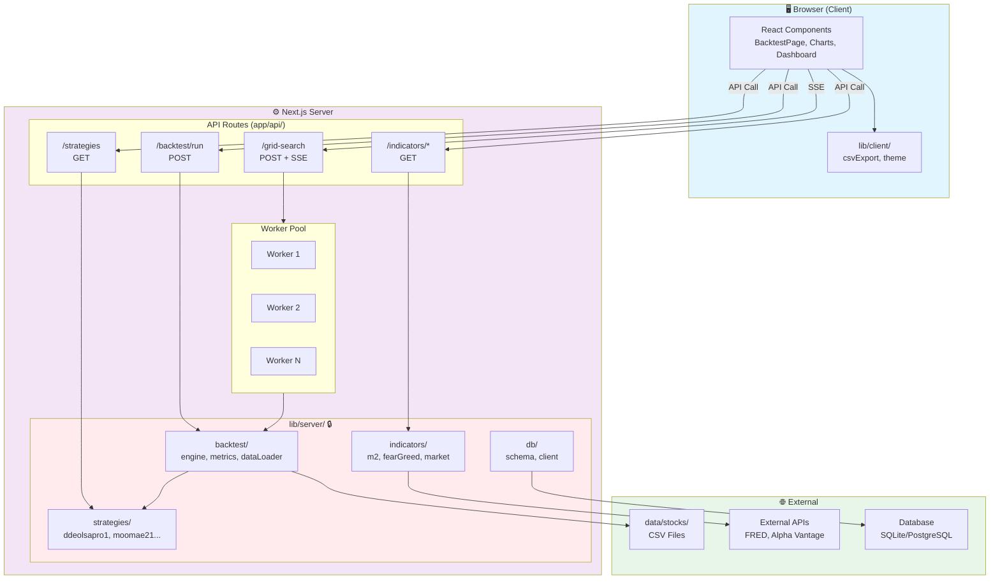

# StockDash 백엔드 분리 사전 점검 체크리스트

## 목표
현재 프론트엔드 전용 아키텍처를 백엔드로 분리하기 위한 사전 점검 항목 정리

---

## 1. 현재 아키텍처 분석 결과

### 데이터 흐름 (현재 - 모두 클라이언트에서 실행)
```
[Browser]
CSV fetch → parseCSV() → Strategy.execute() → calculateMetrics() → 차트 렌더링
     ↑                         ↑                      ↑
  네트워크 I/O           무거운 연산            무거운 연산
```

### 모듈별 백엔드 이전 난이도

| 모듈 | 파일 | 난이도 | 브라우저 의존성 |
|------|------|--------|----------------|
| BacktestEngine | `lib/backtest/engine.ts` | 🟢 0/10 | 없음 |
| Metrics | `lib/backtest/metrics.ts` | 🟢 0/10 | 없음 |
| Strategies | `lib/strategies/*.ts` | 🟢 0/10 | 없음 |
| DataLoader | `lib/backtest/dataLoader.ts` | 🟢 2/10 | `fetch` API만 |
| CSV Export | `lib/backtest/csvExport.ts` | 🟢 1/10 | `downloadCSV()` 함수만 |
| Types | `types/backtest.ts` | 🟢 0/10 | 없음 |

---

## 2. 아키텍처 개념도

### A. 현재 아키텍처 (클라이언트 중심)

```
┌─────────────────────────────────────────────────────────────────────────────┐
│                              BROWSER (Client)                                │
│  ┌─────────────────────────────────────────────────────────────────────────┐│
│  │                         React Components                                 ││
│  │  ┌──────────────┐  ┌──────────────┐  ┌──────────────┐                   ││
│  │  │ BacktestPage │  │ EquityChart  │  │ DrawdownChart│                   ││
│  │  └──────┬───────┘  └──────────────┘  └──────────────┘                   ││
│  │         │                                                                ││
│  │         ▼                                                                ││
│  │  ┌─────────────────────────────────────────────────────────────────┐    ││
│  │  │                    lib/backtest/ (클라이언트 실행)               │    ││
│  │  │  ┌────────────┐  ┌────────────┐  ┌────────────┐  ┌───────────┐  │    ││
│  │  │  │ dataLoader │→ │  engine    │→ │  metrics   │→ │ csvExport │  │    ││
│  │  │  │  (fetch)   │  │ (⚠️ heavy) │  │ (⚠️ heavy) │  │           │  │    ││
│  │  │  └────────────┘  └────────────┘  └────────────┘  └───────────┘  │    ││
│  │  └─────────────────────────────────────────────────────────────────┘    ││
│  │         │                                                                ││
│  │         ▼                                                                ││
│  │  ┌─────────────────────────────────────────────────────────────────┐    ││
│  │  │                  lib/strategies/ (⚠️ 코드 노출)                  │    ││
│  │  │  ┌─────────────┐  ┌─────────────┐  ┌─────────────┐              │    ││
│  │  │  │ ddeolsapro1 │  │ ddeolsapro2 │  │   moomae21  │              │    ││
│  │  │  └─────────────┘  └─────────────┘  └─────────────┘              │    ││
│  │  └─────────────────────────────────────────────────────────────────┘    ││
│  └─────────────────────────────────────────────────────────────────────────┘│
└─────────────────────────────────────────────────────────────────────────────┘
         │ fetch()
         ▼
┌─────────────────────────────────────────────────────────────────────────────┐
│                           Next.js Server                                     │
│  ┌──────────────────────┐   ┌──────────────────────────────────────────┐    │
│  │  /api/tickers        │   │         public/data/stocks/              │    │
│  │  (티커 목록만 제공)    │   │         CSV 파일 (정적 서빙)              │    │
│  └──────────────────────┘   └──────────────────────────────────────────┘    │
└─────────────────────────────────────────────────────────────────────────────┘

⚠️ 문제점:
• UI 블로킹: 50-500ms (메인 스레드에서 연산)
• 전략 코드 노출: JS 번들에 포함
• 대규모 연산 불가: 브라우저 메모리/CPU 제한
• 딥마이닝 불가능: 병렬 처리 한계
```

---

### B. 개선 아키텍처 (서버 중심)

```
┌─────────────────────────────────────────────────────────────────────────────┐
│                              BROWSER (Client)                                │
│  ┌─────────────────────────────────────────────────────────────────────────┐│
│  │                         React Components                                 ││
│  │  ┌──────────────┐  ┌──────────────┐  ┌──────────────┐                   ││
│  │  │ BacktestPage │  │ EquityChart  │  │  Dashboard   │                   ││
│  │  └──────┬───────┘  └──────────────┘  └──────┬───────┘                   ││
│  │         │                                    │                           ││
│  │         │ API 호출 (비동기)                   │                           ││
│  │         ▼                                    ▼                           ││
│  │  ┌─────────────────────────────────────────────────────────────────┐    ││
│  │  │                    lib/client/ (경량화)                          │    ││
│  │  │  ┌────────────┐  ┌────────────┐                                 │    ││
│  │  │  │ csvExport  │  │   theme    │   (다운로드/테마만 클라이언트)    │    ││
│  │  │  └────────────┘  └────────────┘                                 │    ││
│  │  └─────────────────────────────────────────────────────────────────┘    ││
│  └─────────────────────────────────────────────────────────────────────────┘│
└─────────────────────────────────────────────────────────────────────────────┘
         │                              │                        │
         │ POST /api/backtest/run       │ GET /api/indicators/*  │ SSE
         ▼                              ▼                        ▼
┌─────────────────────────────────────────────────────────────────────────────┐
│                           Next.js Server (API Routes)                        │
│                                                                              │
│  ┌───────────────────────────────────────────────────────────────────────┐  │
│  │                          API Layer (app/api/)                         │  │
│  │  ┌─────────────┐ ┌─────────────┐ ┌─────────────┐ ┌─────────────────┐  │  │
│  │  │  /backtest  │ │ /strategies │ │ /indicators │ │  /grid-search   │  │  │
│  │  │    /run     │ │             │ │  /m2, /fng  │ │  (SSE stream)   │  │  │
│  │  └──────┬──────┘ └──────┬──────┘ └──────┬──────┘ └────────┬────────┘  │  │
│  └─────────┼───────────────┼───────────────┼─────────────────┼───────────┘  │
│            │               │               │                 │              │
│            ▼               ▼               ▼                 ▼              │
│  ┌───────────────────────────────────────────────────────────────────────┐  │
│  │                     lib/server/ (서버 전용 - 🔒 보호됨)                │  │
│  │                                                                       │  │
│  │  ┌─────────────────────────────────────────────────────────────────┐  │  │
│  │  │                        backtest/                                │  │  │
│  │  │  ┌────────────┐  ┌────────────┐  ┌────────────┐                │  │  │
│  │  │  │ dataLoader │→ │   engine   │→ │  metrics   │                │  │  │
│  │  │  │   (fs)     │  │            │  │            │                │  │  │
│  │  │  └────────────┘  └────────────┘  └────────────┘                │  │  │
│  │  └─────────────────────────────────────────────────────────────────┘  │  │
│  │                                                                       │  │
│  │  ┌─────────────────────────────────────────────────────────────────┐  │  │
│  │  │                   strategies/ (🔒 비공개)                        │  │  │
│  │  │  ┌─────────────┐  ┌─────────────┐  ┌─────────────┐              │  │  │
│  │  │  │ ddeolsapro1 │  │ ddeolsapro2 │  │   moomae21  │              │  │  │
│  │  │  └─────────────┘  └─────────────┘  └─────────────┘              │  │  │
│  │  └─────────────────────────────────────────────────────────────────┘  │  │
│  │                                                                       │  │
│  │  ┌─────────────────────────────────────────────────────────────────┐  │  │
│  │  │                      indicators/                                │  │  │
│  │  │  ┌────────────┐  ┌────────────┐  ┌────────────┐                │  │  │
│  │  │  │ m2Fetcher  │  │ marketData │  │ fearGreed  │                │  │  │
│  │  │  └────────────┘  └────────────┘  └────────────┘                │  │  │
│  │  └─────────────────────────────────────────────────────────────────┘  │  │
│  │                                                                       │  │
│  │  ┌─────────────────────────────────────────────────────────────────┐  │  │
│  │  │                         db/ (선택)                              │  │  │
│  │  │  ┌────────────┐  ┌────────────┐                                │  │  │
│  │  │  │   schema   │  │   client   │   (SQLite → PostgreSQL)        │  │  │
│  │  │  └────────────┘  └────────────┘                                │  │  │
│  │  └─────────────────────────────────────────────────────────────────┘  │  │
│  └───────────────────────────────────────────────────────────────────────┘  │
│            │                                            │                   │
│            ▼                                            ▼                   │
│  ┌──────────────────────┐              ┌──────────────────────────────────┐ │
│  │   data/stocks/       │              │        External APIs             │ │
│  │   (서버 파일시스템)    │              │  FRED, Alpha Vantage, etc.       │ │
│  └──────────────────────┘              └──────────────────────────────────┘ │
└─────────────────────────────────────────────────────────────────────────────┘

✅ 개선점:
• UI 블로킹 제거: 0ms (비동기 API 호출)
• 전략 코드 보호: 서버에서만 실행, 클라이언트 번들 미포함
• 대규모 연산 가능: 서버 리소스 활용
• 딥마이닝 지원: Worker Threads 병렬 처리
• 대시보드 지표: 외부 API 연동 가능
```

---

### C. 데이터 흐름 비교

```
[ 현재 - 클라이언트 실행 ]

  User Action          Browser                    Server
       │                  │                         │
       │  버튼 클릭        │                         │
       ├─────────────────►│                         │
       │                  │  fetch CSV              │
       │                  ├────────────────────────►│
       │                  │◄────────────────────────│
       │                  │                         │
       │    ⏳ 50-500ms   │  parseCSV()             │
       │    UI 블로킹      │  strategy.execute()    │
       │                  │  calculateMetrics()    │
       │                  │                         │
       │◄─────────────────│  결과 렌더링            │
       │                  │                         │


[ 개선 후 - 서버 실행 ]

  User Action          Browser                    Server
       │                  │                         │
       │  버튼 클릭        │                         │
       ├─────────────────►│                         │
       │                  │  POST /api/backtest    │
       │                  ├────────────────────────►│
       │                  │                         │  fs.readFile()
       │    ✅ 0ms        │                         │  parseCSV()
       │    UI 반응 가능   │                         │  strategy.execute()
       │                  │                         │  calculateMetrics()
       │                  │◄────────────────────────│
       │◄─────────────────│  결과 렌더링            │
       │                  │                         │
```

---

### D. 딥마이닝 아키텍처 (그리드 서치)

```
┌─────────────────────────────────────────────────────────────────────────────┐
│                              BROWSER                                         │
│  ┌─────────────────────────────────────────────────────────────────────────┐│
│  │  Deep Mining UI                                                          ││
│  │  ┌────────────────┐  ┌────────────────┐  ┌────────────────────────────┐ ││
│  │  │ Parameter Grid │  │ Progress Bar   │  │  Results Table (Top 10)    │ ││
│  │  │ 설정 폼         │  │ ████████░░ 80% │  │  Rank | Params | CAGR | MDD│ ││
│  │  └────────┬───────┘  └───────▲────────┘  └────────────────────────────┘ ││
│  │           │                  │ SSE                                       ││
│  └───────────┼──────────────────┼───────────────────────────────────────────┘│
└──────────────┼──────────────────┼───────────────────────────────────────────┘
               │                  │
               │ POST             │ EventSource
               ▼                  │
┌─────────────────────────────────────────────────────────────────────────────┐
│                           Next.js Server                                     │
│  ┌───────────────────────────────────────────────────────────────────────┐  │
│  │  POST /api/backtest/grid-search                                       │  │
│  │  ┌─────────────────────────────────────────────────────────────────┐  │  │
│  │  │  1. 파라미터 조합 생성                                            │  │  │
│  │  │     dropPercent: [3,4,5] × tierMode: [A,B] = 6개 조합             │  │  │
│  │  └─────────────────────────────────────────────────────────────────┘  │  │
│  │                              │                                        │  │
│  │                              ▼                                        │  │
│  │  ┌─────────────────────────────────────────────────────────────────┐  │  │
│  │  │  2. Worker Pool (병렬 처리)                                       │  │  │
│  │  │  ┌──────────┐ ┌──────────┐ ┌──────────┐ ┌──────────┐            │  │  │
│  │  │  │ Worker 1 │ │ Worker 2 │ │ Worker 3 │ │ Worker 4 │            │  │  │
│  │  │  │ 조합 1,5 │ │ 조합 2,6 │ │  조합 3  │ │  조합 4  │            │  │  │
│  │  │  └────┬─────┘ └────┬─────┘ └────┬─────┘ └────┬─────┘            │  │  │
│  │  │       │            │            │            │                  │  │  │
│  │  │       └────────────┴────────────┴────────────┘                  │  │  │
│  │  │                              │                                  │  │  │
│  │  └──────────────────────────────┼──────────────────────────────────┘  │  │
│  │                                 ▼                                     │  │
│  │  ┌─────────────────────────────────────────────────────────────────┐  │  │
│  │  │  3. 결과 집계 & SSE 전송                                          │  │  │
│  │  │     → { progress: 80%, results: [...top10] }                    │  │  │
│  │  └─────────────────────────────────────────────────────────────────┘  │  │
│  └───────────────────────────────────────────────────────────────────────┘  │
└─────────────────────────────────────────────────────────────────────────────┘
```

---

### E. 시스템 컴포넌트 다이어그램 (Mermaid)



---

## 3. 점검 항목 체크리스트

### A. 코드 분리 가능성

- [ ] **순수 로직 분리**: engine.ts, metrics.ts, strategies/ 모두 브라우저 API 미사용 확인
- [ ] **의존성 체크**: `dataLoader.ts`의 `fetch` 호출을 Node.js `fs`로 대체 가능
- [ ] **타입 공유**: `types/backtest.ts` 클라이언트/서버 공유 방안 결정

### B. API 설계

- [ ] **백테스트 실행 API**: `POST /api/backtest/run` 스키마 정의
  ```typescript
  Request: { strategyId, tickerId, startDate, endDate, initialCapital, parameters, applyFee }
  Response: BacktestResult (trades, equity, metrics)
  ```
- [ ] **전략 목록 API**: `GET /api/strategies` (현재 클라이언트에서 import)
- [ ] **딥마이닝 API**: `POST /api/backtest/grid-search` (향후)

### C. 데이터 관리

- [ ] **CSV 저장소**: `public/data/` → 서버 파일시스템 또는 DB 마이그레이션
- [ ] **캐싱 전략**: 자주 사용하는 데이터 메모리 캐싱 (Redis 등)
- [ ] **대용량 처리**: 스트림 기반 CSV 파싱 검토

### D. 성능 고려

- [ ] **UI 블로킹 제거**: 현재 50-500ms 블로킹 → API 호출로 비동기화
- [ ] **병렬 처리**: Node.js Worker Threads 또는 클러스터 모드
- [ ] **진행 상황 전송**: WebSocket 또는 SSE로 그리드 서치 진행률 표시

### E. 보안

- [ ] **전략 코드 보호**: 클라이언트 번들에서 전략 로직 제거
- [ ] **API 인증**: 필요시 API 키 또는 세션 기반 인증
- [ ] **Rate Limiting**: 과도한 백테스트 요청 방지

---

## 3. 마이그레이션 단계별 계획

### Phase 1: 기본 백테스트 API (우선순위 최상)
**변경 파일:**
- `app/api/backtest/run/route.ts` (신규)
- `app/backtest/page.tsx` (수정)
- `lib/backtest/dataLoader.ts` (서버용 수정)

**예상 작업량:** 2-3시간

### Phase 2: 전략 레지스트리 API
**변경 파일:**
- `app/api/strategies/route.ts` (신규)

### Phase 3: CSV 내보내기 API
**변경 파일:**
- `app/api/backtest/export/route.ts` (신규)

### Phase 4: 딥마이닝 (그리드 서치)
**변경 파일:**
- `app/api/backtest/grid-search/route.ts` (신규)
- Worker Threads 설정

---

## 4. 권장 아키텍처 (확장 가능한 구조)

### 요구사항 기반 설계
- ✅ UI 성능 개선 (블로킹 제거)
- ✅ 딥마이닝 지원 (대규모 그리드 서치)
- ✅ 전략 코드 보호 (서버 전용 실행)
- ✅ 대시보드 지표 연동 (다양한 데이터 소스)
- ✅ 향후 확장성 (DB, 인증, 결과 저장)

### 권장 기술 스택

| 레이어 | 기술 | 이유 |
|--------|------|------|
| **API Gateway** | Next.js API Routes | 프론트엔드와 동일 배포, 타입 공유 |
| **비즈니스 로직** | `lib/server/` 폴더 분리 | 서버 전용 코드 격리 |
| **데이터베이스** | SQLite → PostgreSQL | 초기 SQLite로 빠른 구현, 확장 시 PostgreSQL |
| **캐싱** | Node.js 메모리 → Redis | 단기: 메모리, 확장 시 Redis |
| **작업 큐** | BullMQ (선택) | 딥마이닝 장시간 작업 처리 |
| **실시간** | Server-Sent Events | WebSocket보다 단순, 단방향 충분 |

### 디렉토리 구조 (제안)

```
app/
├── api/
│   ├── backtest/
│   │   ├── run/route.ts         # POST: 백테스트 실행
│   │   ├── grid-search/route.ts # POST: 딥마이닝
│   │   └── export/route.ts      # POST: CSV 내보내기
│   ├── strategies/route.ts      # GET: 전략 목록
│   ├── tickers/route.ts         # GET: 티커 목록 (기존)
│   └── indicators/              # 대시보드 지표용
│       ├── m2/route.ts          # M2 자금 흐름
│       ├── fear-greed/route.ts  # 공포/탐욕 지수
│       └── market/route.ts      # 시장 지표

lib/
├── server/                      # 🆕 서버 전용 코드
│   ├── backtest/
│   │   ├── engine.ts           # BacktestEngine (이동)
│   │   ├── metrics.ts          # 지표 계산 (이동)
│   │   └── dataLoader.ts       # fs 기반 CSV 로더 (수정)
│   ├── strategies/             # 🔒 전략 코드 (보호됨)
│   │   ├── index.ts
│   │   ├── ddeolsapro1.ts
│   │   └── ...
│   ├── indicators/             # 🆕 대시보드 지표 수집
│   │   ├── m2Fetcher.ts
│   │   └── marketData.ts
│   └── db/                     # 🆕 데이터베이스 레이어
│       ├── schema.ts           # Drizzle/Prisma 스키마
│       └── client.ts
├── shared/                      # 🆕 클라이언트/서버 공유
│   └── types/
│       └── backtest.ts         # 타입 정의 (이동)
└── client/                      # 클라이언트 전용 (기존 유지)
    ├── backtest/
    │   └── csvExport.ts        # downloadCSV 유지
    └── theme/
```

### API 스키마 (대시보드 지표 포함)

```typescript
// 백테스트 실행
POST /api/backtest/run
Request: { strategyId, tickerId, startDate, endDate, initialCapital, parameters, applyFee }
Response: { trades[], equity[], metrics, executionTime }

// 딥마이닝 (비동기)
POST /api/backtest/grid-search
Request: { strategyId, tickerId, paramRanges, topN }
Response: { jobId } → SSE로 진행률 전송

// 대시보드 지표
GET /api/indicators/m2
Response: { date, value, yoy }[]

GET /api/indicators/fear-greed
Response: { date, value, classification }[]

GET /api/indicators/market?symbol=SPY
Response: { price, change, volume, pe, eps }
```

---

## 5. 핵심 파일 경로

### 백엔드 이전 대상
```
lib/backtest/
├── engine.ts         # 매매 실행 로직
├── metrics.ts        # 성과 지표 계산
├── dataLoader.ts     # CSV 로드 (수정 필요)
└── csvExport.ts      # 내보내기 (부분 수정)

lib/strategies/
├── index.ts          # 전략 레지스트리
├── ddeolsapro1.ts    # 전략 구현
├── ddeolsapro2.ts
└── moomae21.ts

types/backtest.ts     # 공유 타입
```

### 클라이언트 유지
```
app/backtest/page.tsx           # UI (API 호출로 변경)
components/backtest/Charts/     # 차트 렌더링
lib/theme/                      # 테마 설정
```

---

## 6. 구현 로드맵

### Phase 1: 기반 구조 설정 (1일)
```
□ lib/server/ 폴더 생성
□ lib/shared/types/ 폴더 생성 및 타입 이동
□ tsconfig.json 경로 별칭 추가 (@/server/*, @/shared/*)
□ 기존 import 경로 업데이트
```

### Phase 2: 백테스트 API (1-2일)
```
□ lib/server/backtest/ 코드 이동
□ dataLoader.ts fs 기반으로 수정
□ app/api/backtest/run/route.ts 구현
□ app/backtest/page.tsx API 호출로 변경
□ 전략 코드 lib/server/strategies/로 이동
```

### Phase 3: 전략 보호 검증 (0.5일)
```
□ 빌드 후 클라이언트 번들에 전략 코드 미포함 확인
□ 브라우저 개발자 도구에서 전략 로직 접근 불가 확인
```

### Phase 4: 대시보드 지표 API (2-3일)
```
□ lib/server/indicators/ 구현
□ 외부 데이터 소스 연동 (FRED API, Alpha Vantage 등)
□ app/api/indicators/ 엔드포인트 구현
□ 대시보드 페이지 API 연동
```

### Phase 5: 딥마이닝 (3-5일)
```
□ app/api/backtest/grid-search/route.ts 구현
□ Worker Threads 또는 BullMQ 설정
□ SSE 진행률 전송 구현
□ 결과 캐싱
```

### Phase 6: 데이터베이스 (선택, 2-3일)
```
□ Drizzle/Prisma 설정
□ 백테스트 결과 저장 스키마
□ 히스토리 조회 API
```

---

## 7. 검증 방법

### A. API 기능 테스트
```bash
# 백테스트 실행
curl -X POST http://localhost:3000/api/backtest/run \
  -H "Content-Type: application/json" \
  -d '{"strategyId":"ddeolsapro1","tickerId":"AAPL","initialCapital":10000000}'

# 전략 목록
curl http://localhost:3000/api/strategies

# 지표 조회
curl http://localhost:3000/api/indicators/m2
```

### B. 전략 코드 보호 확인
```bash
# 빌드 후 확인
npm run build
grep -r "ddeolsapro" .next/static/chunks/  # 결과 없어야 함
```

### C. 성능 비교
```
Before: 클라이언트 백테스트 실행 시간 측정
After: API 응답 시간 측정 (네트워크 포함)
목표: UI 블로킹 0ms, 총 응답 <500ms
```

### D. E2E 테스트
```
1. 백테스트 페이지 접속
2. 전략/티커 선택
3. 백테스트 실행 → 차트 렌더링 확인
4. CSV 내보내기 동작 확인
```

---

## 8. 예상 이점

| 항목 | 현재 | 개선 후 |
|------|------|---------|
| UI 블로킹 | 50-500ms | 0ms |
| 그리드 서치 | 10개 제한 | 1000+ 가능 |
| 전략 보호 | JS 번들에 노출 | 서버에서만 실행 |
| 확장성 | 단일 브라우저 | 서버 스케일링 |
| 대시보드 지표 | 정적/수동 | API 기반 실시간 |
| 결과 저장 | 없음 | DB 히스토리 |

---

## 9. 리스크 및 대응

| 리스크 | 영향 | 대응 방안 |
|--------|------|----------|
| API 지연 | 사용자 경험 저하 | 로딩 스피너 + 캐싱 |
| 서버 부하 | 다중 사용자 시 성능 저하 | Rate limiting + 큐 |
| 외부 API 장애 | 지표 수집 실패 | 폴백 데이터 + 캐시 |
| 마이그레이션 버그 | 기존 기능 오작동 | 단계별 배포 + 롤백 준비 |
